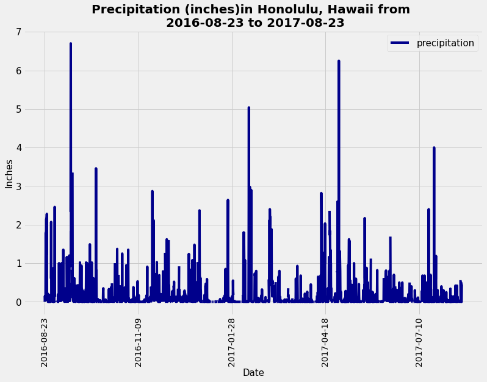
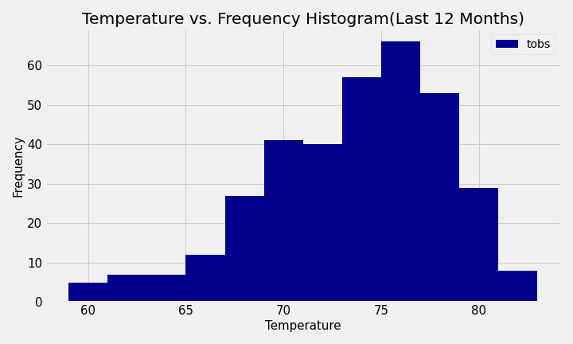
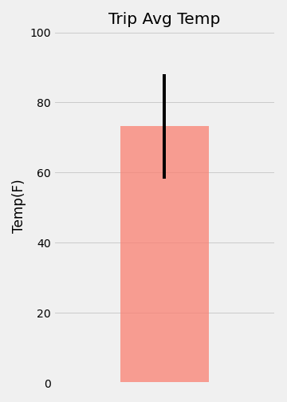
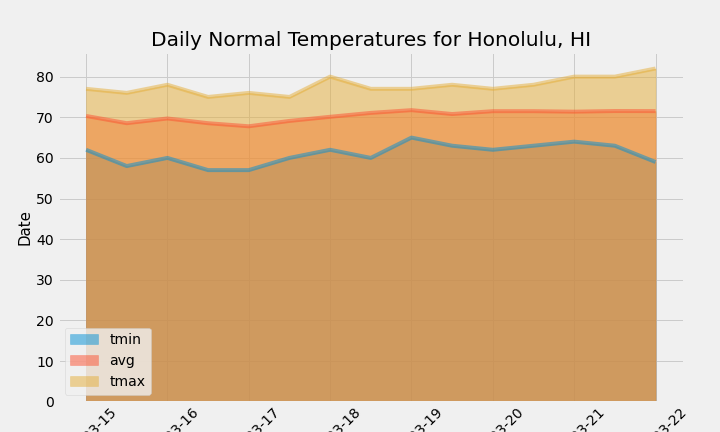

# SQLAlchemy-Challenge - Surfs Up!
**Submitted By:** Saloni Gupta\
_Date_: november, 22nd, 2020 

## Background
This repository is designed to make a climate analysis on Honolulu, Hawaii, to help clients trip planning, and outline when they can plan their vacation.

### Table of Contents
- Climate Analysis and Exploration
- Precipitation Analysis
- Station Analysis
- Climate App
- Temperature Analysis I
- Temperature Analysis II
- Daily Rainfall Average

### Step 1 - Climate Analysis and Exploration
This project used a Python and SQLAlchemy to make climate analysis, and data exploration of the climate database. All of the following analysis completed by using SQLAlchemy ORM queries, Pandas, and Matplotlib. The SQLAlchemy file is also provided here as hawaii.sqlite in Resources folder.

- Python SQL toolkit and Object Relational Mapper
  - import sqlalchemy from sqlalchemy.ext.automap  
  - import automap_base from sqlalchemy.orm  
  - import Session from sqlalchemy  
  - import create_engine, func, inspect  

- SQLAlchemy engine created create_engine to connect to the sqlite database.  
engine = create_engine("sqlite:///hawaii.sqlite")  
- To reflect the tables into classes, and save a reference to those classes called Station and Measurement.  
Base = automap_base() 
- Create our session (link) from Python to the DB  
session = Session(engine)  
- Get a list of column names and types  
inspector = inspect(engine)  
columns = inspector.get_columns('measurement') for c in columns: print(c['name'], c["type"])  

### Precipitation Analysis
- A query is designed to retrieve the last 12 months of precipitation data, and only the date and prcp values is slected.

- The query results also loded into a Pandas DataFrame and the index is set in to the date column, and sorted the DataFrame values by date.

- Finally the result ploted by using the DataFrame plot method.The plot looks as follows:

- By using the Pandas the summary statistics for the precipitation data was performed, and displayed.

### Station Analysis
- A query is designed to calculate the total number of stations, and 9 stations found. To find the most active station list, and observation counts is sorted in descending order. Station USC00519281 has the highest number of observations.

- A query is created to retrieve the last 12 months of temperature observation data (TOBS) and filter by the station with the highest number of observations. The Plot for the results as a histogram with bins=12 were created and it looks as follows.

Step 2 - Climate App
After the initial analysis was completed, a Flask API designed based on the queries already developed.

The following routes are created by using Flask. To look and run the code click the following link:[Climate app.py](./app.py)
Routes
- /

  - Home page.

  - List all routes that are available.

- /api/v1.0/precipitation

   - Convert the query results to a dictionary using date as the key and prcp as the value.

   - Return the JSON representation of your dictionary.

- /api/v1.0/stations

   - Return a JSON list of stations from the dataset.
   
- /api/v1.0/tobs

   - Query the dates and temperature observations of the most active station for the last year of data.

   - Return a JSON list of temperature observations (TOBS) for the previous year.

- /api/v1.0/<start> and /api/v1.0/<start>/<end>

   - Return a JSON list of the minimum temperature, the average temperature, and the max temperature for a given start or start-end range.

   - When given the start only, calculate TMIN, TAVG, and TMAX for all dates greater than and equal to the start date.

   - When given the start and the end date, calculate the TMIN, TAVG, and TMAX for dates between the start and end date inclusive.

### Recommended Analyses
#### Temperature Analysis I
Hawaii is reputed to enjoy mild weather all year.The average temperature in June at all stations across all available years in the dataset is 74.94411764705882 F. The average temperature in December at all stations across all available years in the dataset is 71.04152933421226 F.

Histogram versus Scatter plot of June and December temperature data

Using unpaired t-tests to compare the means of two populations (June temperatures in Hawaii and December temperatures in Hawaii), because unpaired t-tests is used to compare the means of two independent populations. However, a paired t-test (one sample t-test) looks at comparing the sample to the population, which we don't want in this case.

#### Temperature Analysis II
The calc_temps function used to calculate the min, avg, and max temperatures for the trip using the matching dates from the previous year (i.e.,"2017-01-01" if the trip start date was "2018-01-01").

- The min, avg, and max temperature from the previous query used to plot a bar chart, the average temperature used as the bar heigh, and the peak-to-peak (TMAX-TMIN) value as the y error bar (YERR). The plot looks as follows: 

### Daily Rainfall Average
The rainfall per weather station, and the daily normals are calculated, normals are the averages for the min, avg, and max temperatures. A function called daily_normals is used to calculate the daily normals for a specific a given date list for the trip. This dates string are in the format of %m-%d. The list of daily normals also loded into a Pandas DataFrame, indexed equal to the date, and an area plot is conducted (stacked=False) for the daily normals. The plot looks as follows:

Copyright
Trilogy Education Services © 2020. All Rights Reserved.
 
